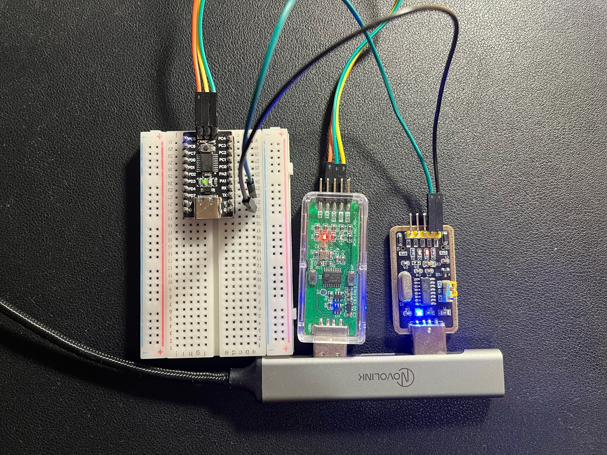

# Моргание светодиодом для CH32V003F4P6

Простой пример прошивки для микроконтроллера CH32V003F4P6, который моргает светодиодом.

## Структура
```
├── ch32v003f4p6.ld         # Скрипт линкера для CH32V003F4P6
├── Makefile                # Файл для сборки
├── README.md               
├── src                     # Директория с исходным кодом
│   └── main.c              # Файл основной программы
└── startup.S               # Startup файл
```

## Сборка прошивки
```bash
# Базовая сборка
make all
```

После успешной сборки в папке `build/` будут созданы файлы:
- `firmware.elf` - ELF файл для отладки и прошивки
- `firmware.bin` - бинарный файл для прошивки

## Загрузка прошивки в микроконтроллер
1. Выполнить для загрузки прошивки в микроконтроллер:
```bash
make flash
```
2. Настроить последовательный порт:
```
stty -F /dev/ttyUSB0 115200 cs8 -cstopb -parenb -echo
```
Для того, чтобы посмтореть текущие настройки UART-a можно воспользоваться командой:
```
stty -F /dev/ttyUSB0 -a
```
3. Открыть последовательный порт:
```bash
sudo cat /dev/ttyUSB0
```
В последовательном порту будет выводиться надпись `Hello word`
```
[slava@slava uartdemo]$ sudo cat /dev/ttyUSB0 
Hello word
Hello word
Hello word
```


## Основные команды Makefile

| Команда | Описание |
|---------|----------|
| `make` или `make all` | Собрать прошивку |
| `make flash`| Собрать и загрузить прошивку |
| `make clean` | Очистить сборочную директорию |

## Схема подключения

Для воспроизведения работы передачи по UART потребуется преобразователь интерфейсов USB-UART. В примере использовался CH340 / USB Type-A. Схема подключения должна быть следующая:

Пин PD5 (Tx) --- Пин RXD CH340 --- USB  
Пин G        --- Пин GND CH340 --- USB  

